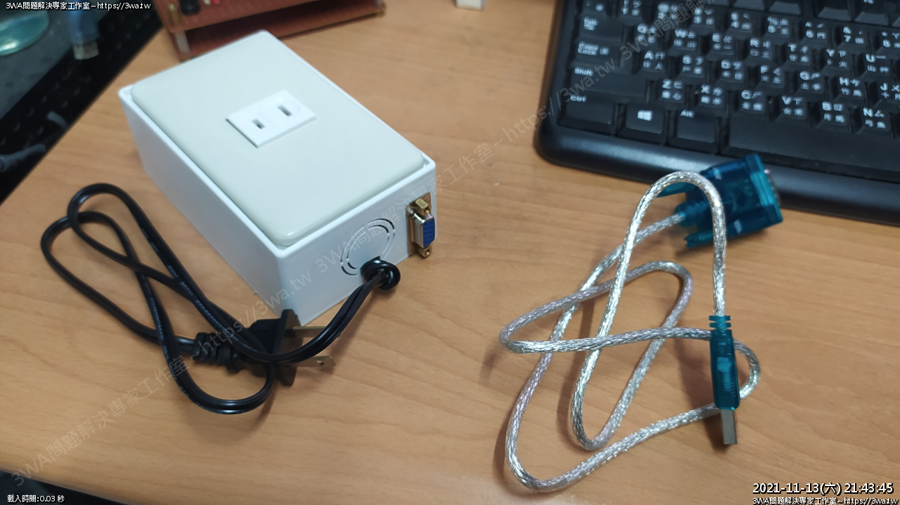
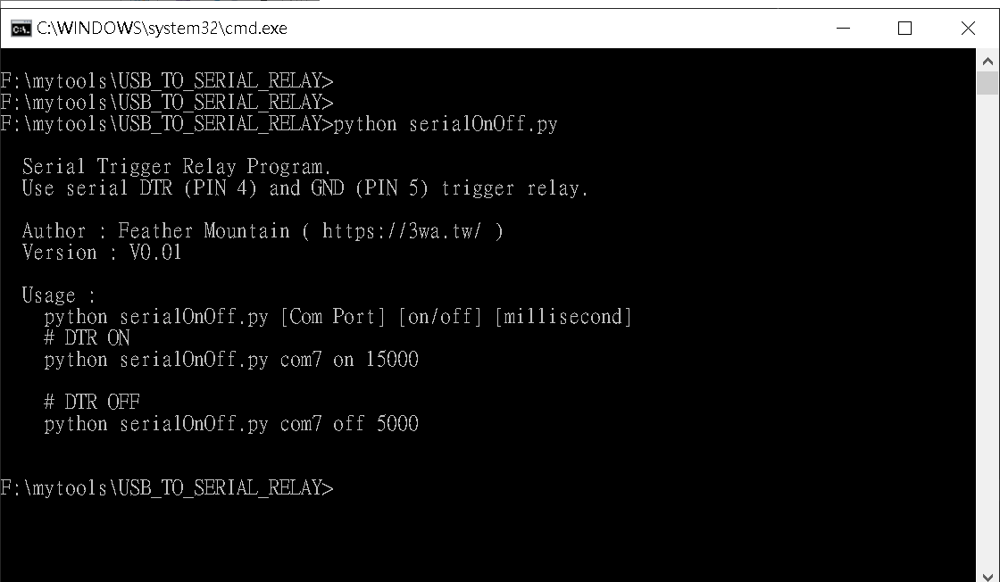

# USB_TO_SERIAL_RELAY

<h2>功能：</h2>
利用 Serial 控制 Relay 讓中華電信的數據機重新開機
 
<h2>作者：</h2>
    羽山秋人 ( https://3wa.tw )
 
 
<h2>版本：</h2>
    V0.01
 
 
<h2>動機：</h2>
由於最近中華的小烏龜三不五十機，只能斷電再開機才能回復正常，USB 轉 Serial 接 Relay，利用程式來切斷電源。
 
 

    完成的圖

 

    使用方式

 
<h2>程式開發語言：</h2>
    python 2.7 (Linux) 
    python 3.9 x86 (Windows) 

<h2>相依性：</h2>
    pip install pyserial
 
 
<h2>使用方法：</h2>
    python serialOnOff.py 
    python serialOnOff.py [Com Port] [on/off] [millisecond] 
 
<h2>詳細說明：</h2>
    <a href="https://3wa.tw/blog/blog.php?id=1942">https://3wa.tw/blog/blog.php?id=1942</a>    
    